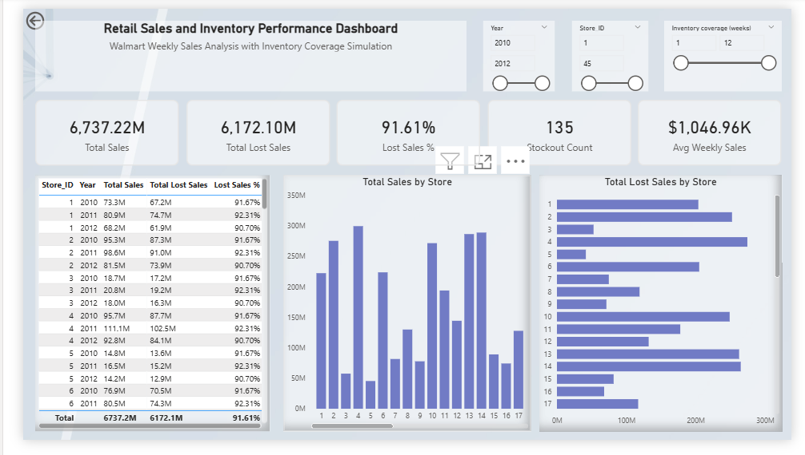
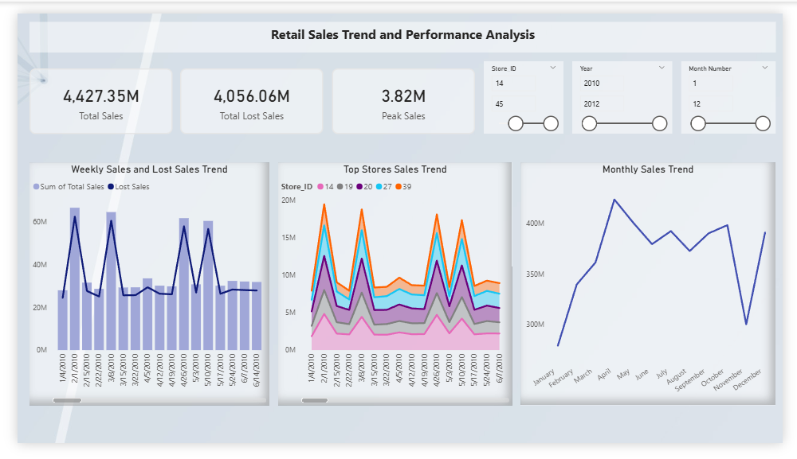
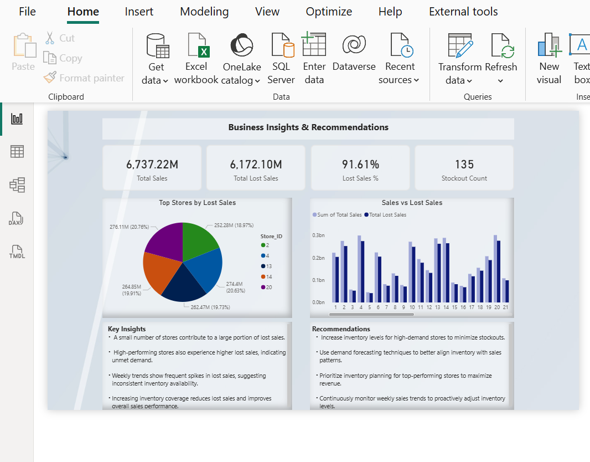

# Retail Inventory & Lost Sales Data Pipeline

An end-to-end data engineering and analytics project using **MySQL** and **Power BI** to analyze Walmart retail sales, simulate inventory coverage, identify stockout risk, and estimate lost sales.

## Dashboard Preview

## Executive Summary

This dashboard provides a high-level overview of business performance by showing total sales, lost sales, stockout count, and average weekly sales. It helps stakeholders quickly understand overall performance and identify areas with potential revenue loss.

## Trend Analysis

This dashboard analyzes sales trends over time to identify patterns, seasonality, and fluctuations in demand. It helps businesses improve forecasting accuracy and plan inventory more effectively.

## Business Insights

This dashboard highlights key insights such as high-demand stores experiencing frequent stockouts and significant lost sales. It provides actionable recommendations to optimize inventory allocation and reduce revenue loss.

## Project Overview

Retail businesses frequently lose revenue when demand exceeds available inventory.  
This project was designed to analyze retail sales data, simulate inventory behavior, and estimate lost sales caused by stockouts.

The solution combines:
- **SQL** for data ingestion, cleaning, modeling, and analytical queries
- **Power BI** for dashboard design and business insight visualization

## Objectives

- Build a clean retail analytics pipeline from raw data to dashboard
- Design a dimensional model using fact and dimension tables
- Simulate inventory using average weekly demand and weeks of cover
- Detect stockout conditions
- Estimate lost sales caused by insufficient inventory
- Provide business insights through interactive dashboards

## Tools & Technologies

- **MySQL**
- **Power BI**
- **Excel / CSV**
- **GitHub**

## Data Pipeline Architecture

The project follows this pipeline:

1. **Raw Data Layer**
   - Walmart sales dataset imported into MySQL
   - Stored in `raw_walmart_sales`

2. **Staging Layer**
   - Data cleaned and transformed in `stg_sales`
   - Date conversion and validation performed

3. **Data Model Layer**
   - Fact table: `fact_sales`
   - Dimension tables:
     - `dim_store`
     - `dim_date`

4. **Analytical Layer**
   - SQL views created for:
     - total sales
     - average weekly sales
     - starting inventory
     - simulated inventory
     - stockout flag
     - lost sales

5. **Visualization Layer**
   - Power BI dashboard with:
     - Executive Summary
     - Trend Analysis
     - Business Insights & Recommendations

## Star Schema

This project uses a **star schema**:

- `fact_sales` stores transactional sales metrics
- `dim_store` stores store-level attributes
- `dim_date` stores time-based attributes

This structure supports efficient querying and scalable reporting.

## Business Logic

The following business logic was used:

- **Starting Inventory = Average Weekly Sales × Weeks of Cover**
- **Stockout Flag = 1 when Simulated Inventory ≤ 0**
- **Lost Sales = unmet demand represented by negative inventory gap**

This approach helps estimate inventory insufficiency using available sales data.

## SQL Components

The SQL portion of the project includes:

- raw table creation
- data loading
- staging cleanup
- fact and dimension creation
- analytical views
- reporting queries

Example analytical outputs:
- Top 10 stores by total sales
- Top 10 stores by lost sales
- Yearly performance analysis
- Monthly sales trends
- Stockout analysis by store and year

## Power BI Dashboard Pages

### 1. Executive Summary
- Total Sales
- Total Lost Sales
- Lost Sales %
- Stockout Count
- Top 10 Stores by Sales
- Top 10 Stores by Lost Sales

### 2. Trend Analysis
- Weekly Sales Trend
- Monthly Sales Trend
- Top Store Performance

### 3. Business Insights & Recommendations
- KPI summary
- High-risk store analysis
- Key insights
- Inventory improvement recommendations

## Key Insights

- High-performing stores tend to experience higher lost sales
- Lost sales are concentrated in a relatively small number of stores
- Limited inventory coverage increases stockout risk significantly
- Store-level analysis helps prioritize where inventory improvements are needed

## Business Recommendations

- Increase inventory coverage for high-demand stores
- Use demand forecasting to better align supply with demand
- Monitor weekly and monthly trends to proactively adjust inventory
- Prioritize stores with high sales and high lost sales for intervention

## Repository Structure

sql/        -> SQL scripts for modeling and analysis
powerbi/    -> Power BI dashboard link or file reference
reports/    -> final report and presentation
images/     -> dashboard screenshots and architecture diagram
data/       -> dataset source information
docs/       -> supporting notes
